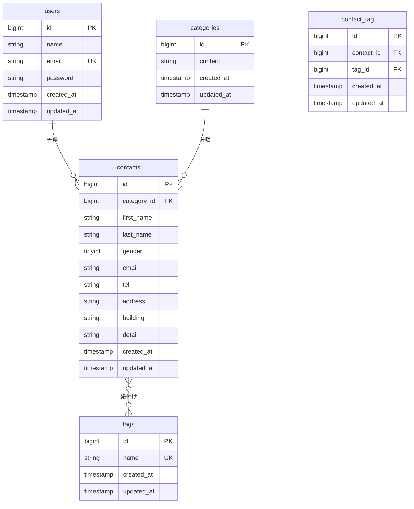

# 要件定義書（Laravel / バックエンド実装用）
- プロジェクト名：お問い合わせ管理システム
---
## 1. 概要
### 1.1 目的
- 本書は、Laravelでバックエンドを実装するために必要な仕様を定義する（フロントはBlade実装済み）。
- 実務に近いWebアプリケーション開発の一連の流れを体験し、自走できるエンジニアになるための基礎体力を養うことを目的とした確認テストのバックエンド要件を明確化する。

### 1.2 前提・制約
- フレームワーク：Laravel 10.x
- フロント：Bladeは実装完了済みであり、本要件定義の対象外とする。
- 実装範囲：バックエンド（ルーティング、認証/認可、DB、ビジネスロジック、API等）

### 1.3 スコープ（対象 / 非対象）
- **対象**：
  - データベースの設計と構築（マイグレーション、シーディング）
  - ユーザー向け機能（お問い合わせフォームの処理）のバックエンド実装
  - 管理者向け機能（認証、お問い合わせ管理）のバックエンド実装
  - 応用機能（タグ管理、CSVエクスポート）のバックエンド実装
  - 上記機能を実現するためのAPI（Web, JSON）実装
- **非対象**：
  - BladeテンプレートのUI実装・修正
  - サーバーインフラの構築（Docker/Sail環境のセットアップ手順は「2. 環境構築」に記載）

---
## 2. 環境構築（必須）
### 2.1 動作要件
| コンポーネント | 技術/ツール | バージョン/種類 |
| :--- | :--- | :--- |
| OS | （Dockerが動作する任意のOS） | - |
| PHP | PHP | `8.2` |
| Laravel | Laravel | `10.x` |
| DB | MySQL | - |
| Webサーバー | Nginx | - |
| フロントエンド | Vite, Tailwind CSS | `^3.4.0` |
| 開発ツール | Docker, Laravel Sail, phpMyAdmin | - |

### 2.2 セットアップ手順
1. リポジトリ取得： `git clone` でリポジトリをクローン
2. 依存インストール：`composer install`
3. env作成：`.env.example` をコピーして `.env` を作成し、`php artisan key:generate` を実行
4. DB作成：Laravel Sail環境下で自動的に作成
5. migrate/seed：`php artisan migrate --seed` を実行
6. 起動：`./vendor/bin/sail up -d`
7. Queue（必要なら）：本プロジェクトでは使用しない

### 2.3 環境変数（最低限）
| Key | 必須 | 用途/意味 | 例 |
|---|---:|---|---|
| APP_NAME | ✅ | アプリケーション名 | Laravel |
| APP_ENV | ✅ | 実行環境 | local |
| APP_KEY | ✅ | アプリケーション暗号化キー | `base64:...` |
| APP_DEBUG | ✅ | デバッグモード | true |
| APP_URL | ✅ | アプリケーションURL | http://localhost |
| DB_CONNECTION | ✅ | DB接続ドライバ | mysql |
| DB_HOST | ✅ | DBホスト | mysql |
| DB_PORT | ✅ | DBポート | 3306 |
| DB_DATABASE | ✅ | DB名 | `contact_form_app` |
| DB_USERNAME | ✅ | DBユーザー名 | `sail` |
| DB_PASSWORD | ✅ | DBパスワード | `password` |

---
## 3. 機能一覧
### 基本機能
| No | 機能名 | 詳細 |
|---|---|---|
| 1 | お問い合わせフォーム | ユーザーが氏名、連絡先、お問い合わせ内容などを入力し、システムに送信する機能。 |
| 2 | 認証 | 管理者がシステムにログイン・ログアウトするための機能。未認証ユーザーのアクセスを制限する。 |
| 3 | 管理画面 | 管理者が登録されたお問い合わせを一覧で確認し、検索、詳細表示、削除を行う機能。 |

### 応用機能
| No | 機能名 | 詳細 |
|---|---|---|
| 4 | タグ管理 | 管理者がお問い合わせに付与する「タグ」を自由に作成、更新、削除できる機能。 |
| 5 | CSVエクスポート | 管理者が検索条件で絞り込んだお問い合わせデータをCSVファイルとしてダウンロードできる機能。 |

---
## 4. データ設計（DB）
### 4.1 ER図（簡易）

### 4.2 テーブル定義
#### `users` テーブル
- **マイグレーション**: Laravel標準の `create_users_table` を利用。
- **役割**: 管理者アカウント情報を格納する。

#### `categories` テーブル
- **マイグレーション**: `create_categories_table`
- **役割**: お問い合わせの種類を管理するマスターテーブル。
- **スキーマ**:
  - `id()`: 主キー
  - `string('content', 255)`: カテゴリ名
  - `timestamps()`: 作成日時、更新日時

#### `contacts` テーブル
- **マイグレーション**: `create_contacts_table`
- **役割**: ユーザーからのお問い合わせ情報を格納するメインテーブル。
- **スキーマ**:
  - `id()`: 主キー
  - `foreignId('category_id')->constrained('categories')->onDelete('cascade')`: 外部キー
  - `string('first_name', 255)`: 姓
  - `string('last_name', 255)`: 名
  - `tinyInteger('gender')`: 性別 (1:男性, 2:女性, 3:その他)
  - `string('email', 255)`: メールアドレス
  - `string('tel', 11)`: 電話番号（ハイフンなし10〜11桁）
  - `string('address', 255)`: 住所
  - `string('building', 255)->nullable()`: 建物名
  - `string('detail', 120)`: お問い合わせ内容
  - `timestamps()`: 作成日時、更新日時

#### `tags` テーブル
- **マイグレーション**: `create_tags_table`
- **役割**: お問い合わせに付与するタグを管理するマスターテーブル。
- **スキーマ**:
  - `id()`: 主キー
  - `string('name', 50)->unique()`: タグ名
  - `timestamps()`: 作成日時、更新日時

#### `contact_tag` テーブル
- **マイグレーション**: `create_contact_tag_table`
- **役割**: `contacts`と`tags`の多対多リレーションを定義する中間テーブル。
- **スキーマ**:
  - `id()`: 主キー
  - `foreignId('contact_id')->constrained()->onDelete('cascade')`: 外部キー
  - `foreignId('tag_id')->constrained()->onDelete('cascade')`: 外部キー
  - `timestamps()`: 作成日時、更新日時

### 4.3 モデル定義
#### `Category` モデル
- `protected $fillable = ['content'];`
- `contacts()`: `hasMany(Contact::class)`

#### `Contact` モデル
- `protected $fillable = ['category_id', 'first_name', ...];` (全カラム)
- `category()`: `belongsTo(Category::class)`
- `tags()`: `belongsToMany(Tag::class)`

#### `Tag` モデル
- `protected $fillable = ['name'];`
- `contacts()`: `belongsToMany(Contact::class)`

#### `User` モデル
- Laravel標準のモデルを利用。

---
## 5. 初期データ（シーディング）
#### `UserSeeder`
- `User::create` を使用し、以下のテストユーザーを1件作成する。
  - `name`: 'Test User'
  - `email`: 'test@example.com'
  - `password`: `Hash::make('password')`

#### `CategorySeeder`
- `Category::create` を使用し、以下の5件のカテゴリを登録する。
  - '商品のお届けについて', '商品の交換について', '商品トラブル', 'ショップへのお問い合わせ', 'その他'

#### `ContactSeeder`
- `Faker::create('ja_JP')` を利用して、リアルなダミーデータを20件作成する。
- `Category::all()->random()->id` でランダムなカテゴリIDを割り当てる。
- `tel` は `$faker->numerify('###########')` で11桁の数字を生成する。
- `building` は `$faker->optional()->secondaryAddress` で確率的にNULLを許容する。

#### `DatabaseSeeder`
- `run` メソッド内で `$this->call()` を使用し、`UserSeeder`, `CategorySeeder`, `ContactSeeder` の順で呼び出す。

---
## 6. ルーティング
### `routes/web.php`
| Method | Path | Controller@Action | Middleware |
|---|---|---|---|
| GET | `/` | `ContactController@index` | - |
| GET | `/thanks` | `ContactController@thanks` | - |
| GET | `/admin` | `AdminController@index` | `auth` |
| GET | `/contacts/export` | `ContactController@export` | `auth` |

### `routes/api.php`
| Method | Path | Controller@Action | Middleware |
|---|---|---|---|
| GET | `/categories` | `Api\CategoryController@index` | - |
| GET | `/contacts` | `Api\ContactController@index` | - |
| POST | `/contacts` | `Api\ContactController@store` | - |
| GET | `/contacts/{contact}` | `Api\ContactController@show` | - |
| DELETE | `/contacts/{contact}` | `Api\ContactController@destroy` | - |
| GET | `/tags` | `Api\TagController@index` | - |
| POST | `/tags` | `Api\TagController@store` | - |
| PUT | `/tags/{tag}` | `Api\TagController@update` | - |
| DELETE | `/tags/{tag}` | `Api\TagController@destroy` | - |

---
## 7. バリデーション (FormRequest)
#### `StoreContactRequest`
- **rules()**:
  - `first_name`, `last_name`, `address`: `required|string|max:255`
  - `gender`: `required|integer|in:1,2,3`
  - `email`: `required|string|email|max:255`
  - `tel`: `required|string|regex:/^[0-9]{10,11}$/`
  - `category_id`: `required|exists:categories,id`
  - `detail`: `required|string|max:120`
  - `tags`: `nullable|array`
  - `tags.*`: `exists:tags,id`
- **messages()**: 各ルールに対応する日本語のエラーメッセージを定義する。

#### `IndexContactRequest` (管理画面検索用)
- **rules()**:
  - `keyword`: `nullable|string|max:255`
  - `gender`: `nullable|integer|in:0,1,2,3`
  - `category_id`: `nullable|integer|exists:categories,id`
  - `date`: `nullable|date`

#### `ExportContactRequest` (CSVエクスポート用)
- `IndexContactRequest` と同様のルールを定義する。

#### `StoreTagRequest`
- `name`: `required|string|max:50|unique:tags,name`

#### `UpdateTagRequest`
- `name`: `required|string|max:50|unique:tags,name,{$this->tag->id}` (自身のIDを除外してユニークチェック)

---
## 8. コントローラーロジック詳細
### `Api/ContactController@index`
- `IndexContactRequest` でバリデーション済みのリクエストを取得する。
- `Contact::with('category')` でクエリを開始する。
- `keyword`, `gender`, `category_id`, `date` の各条件で `if ($request->filled(...))` を用いてクエリを動的に構築する。
- `keyword` 検索は `first_name`, `last_name`, `email` を対象とした `orWhere` を使用する。
- `latest()->paginate(7)` で結果を取得する。
- `ContactResource::collection()` で結果をラップして返す。

### `Api/ContactController@store`
- `StoreContactRequest` でバリデーションを行う。
- `DB::transaction()` を使用して、お問い合わせ登録とタグ紐付けをアトミックに行う。
- `Contact::create()` でお問い合わせを保存する。
- `if ($request->filled('tags'))` でタグの存在をチェックし、`$contact->tags()->attach($request->tags)` で紐付けを行う。
- 成功後、`/thanks` へリダイレクトする。

### `ContactController@export`
- `ExportContactRequest` でバリデーションを行う。
- `Api/ContactController@index` と同様のロジックで検索クエリを構築する。
- `latest()->get()` で全件取得する。
- `response()->streamDownload()` を使用してCSVをストリーム出力する。
  - ファイル名のフォーマットは `contacts_YYYYMMDD_HHMMSS.csv` とする。
  - `fwrite($handle, "\xEF\xBB\xBF");` でBOMを先頭に書き込む。
  - `fputcsv()` で1行ずつデータを書き込む。性別は `match` 式で数値から文字列に変換する。

---
## 9. 認証・認可
- **認証方式**: セッションベース認証（Laravel Fortifyを利用）。
- **アクセス制御**: `/admin` と `/contacts/export` のルートに `auth` ミドルウェアを適用する。
- **権限NG時の挙動**: `auth`ミドルウェアにより、未認証ユーザーはログインページ(`/login`)へリダイレクトされる。

---
## 10. 受け入れ条件
- **主要なユーザーフロー**：
  1. ユーザーがお問い合わせフォームから情報を入力し、送信すると、内容がDBに保存され、完了ページが表示される。
  2. 管理者がログインし、管理画面でお問い合わせ一覧を閲覧・検索・削除できる。
  3. 管理者が管理画面の検索条件に連動したCSVファイルをエクスポートできる。
  4. 管理者がAPIを通じてタグのCRUD操作を行える。
- **成功条件**：
  - 上記フローがエラーなく完了し、DBの状態が期待通りに更新されていること。
  - バリデーションが正しく機能し、不正なデータは登録されないこと。
- **エラー条件**：
  - 必須項目未入力でフォームを送信した場合、バリデーションエラーが返されること。
  - 未ログイン状態で管理画面にアクセスしようとした場合、ログインページにリダイレクトされること。

